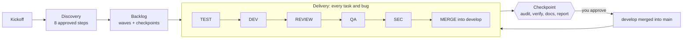

# WholeTeam

A software factory for AI coding agents. WholeTeam turns Claude Code or OpenAI Codex into a complete software team (Product Owner, Architect, Developer, Test Engineer, QA, Security and more) that defines your product with you and then builds it task by task, with tests, code review, QA and security checks at every step.

## 1. What it is

WholeTeam is a set of guidelines, role definitions, workflow rules, templates and installer scripts. You clone it once, install it into an existing git project, open the project in VS Code, start Claude Code or Codex, and type `Let's code`.

From then on the main session acts as the **Orchestrator**. It talks to you, keeps the project state in files, and delegates specialist work to role agents, each running on a model tier suited to its job:

1. **Discovery:** it defines the product with you in 8 short steps, each one approved by you.
2. **Backlog:** it generates tasks with a dependency graph, waves and checkpoints.
3. **Delivery:** it builds the backlog one task at a time, or several in parallel, through test, development, code review, QA and security gates, and stops at checkpoints so you can validate a working product.

## 2. How it works



- **Phases.** Kickoff (language, git checks), Discovery (vision, stack, architecture, stack profile, design, constraints, testing, backlog), Delivery, and Maintenance (bug fixes after the last task).
- **Roles.** The Orchestrator (your main session) plus 13 role agents: Product Owner, UX/UI Designer, Architect, Tech Lead, Developer, Test Engineer, QA, Security, DBA, DevOps, Tech Writer, Support and Backlog Validator. Each runs on a `high`, `medium` or `low` model tier.
- **Gates.** The Test Engineer writes tests before the Developer implements. The Tech Lead (plus the DBA and UX/UI Designer where relevant) reviews the diff, QA verifies every acceptance criterion by running the product, and Security reviews at the depth each task needs. Rejections go back to development, up to a limit, and then you decide.
- **Checkpoints.** Milestones in the backlog. At each one the factory audits, runs the full verification, updates the product README, API docs and CHANGELOG, writes a report with a validation checklist, and merges `develop` into `main`, through a pull request when `gh` or `glab` is available.

## 3. Requirements

- **git.**
- **A shell:** bash (Linux, macOS, Git Bash on Windows) or PowerShell (Windows PowerShell 5.1 or PowerShell 7).
- **Claude Code or Codex,** with subagent support.
- **Optional:** `gh` (GitHub CLI) or `glab` (GitLab CLI), authenticated, so checkpoints open pull requests.
- **Your project:** an existing folder that is already a git repository (it may have no commits yet). The factory never creates project folders.

## 4. Install

Clone WholeTeam once, anywhere on your machine:

```bash
git clone https://github.com/mavalu22/whole-team.git
```

Then run the installer and paste your project's path when asked.

**Linux, macOS, Git Bash:**

```bash
cd whole-team
./install.sh
# or non-interactive:
./install.sh --path ~/code/my-app --type new --yes
```

**Windows PowerShell:**

```powershell
cd whole-team
powershell -ExecutionPolicy Bypass -File .\install.ps1
# or non-interactive:
powershell -ExecutionPolicy Bypass -File .\install.ps1 -Path C:\code\my-app -Type new -Yes
```

The installer asks for the project type:

- `new`: a new product; Discovery starts from the idea.
- `ongoing`: an existing codebase; Discovery starts by analysing the code, and the factory offers a bug and security audit.

Then:

1. Open the project in VS Code.
2. Start Claude Code or Codex **in the project root**. Recommended main-session model: Claude Code `sonnet`; Codex `gpt-6-sol` at medium effort.
3. Type `Let's code`.

## 5. Update

```bash
cd whole-team
git pull
./install.sh --path ~/code/my-app --mode update
```

(or `.\install.ps1 -Path C:\code\my-app -Mode update`). The update replaces `factory/core/` and the `factory-*` agent files, refreshes the WholeTeam blocks, and adds any new starting files. It never touches your `config.yaml`, `state.yaml`, `tasks.md`, `tasks-graph.md`, `bugs.md`, `input/` or `output/`. On your next `Let's code`, the Orchestrator migrates your config and state to the new version if needed. The update resets the agent files to the default models; the next `Let's code` re-applies the models from your `factory/config.yaml`. Restart Claude Code or Codex after updating so the new agent files load.

## 6. Using it

| Command | What it does | Example |
|---|---|---|
| `Let's code` | Start or resume: kickoff, the current Discovery step, or delivery | `Let's code` |
| `Let's code <ID>` | Work on a specific task or bug next, if its dependencies allow | `Let's code B-004` |
| `Support: <description>` | Report a problem or ask how something works; the factory reproduces, classifies and prioritizes it | `Support: the export button does nothing on Safari` |
| `Status` | Show progress: phase, current work, approvals waiting, bugs, next checkpoint | `Status` |
| `Change: <request>` | Change something already approved; it goes back through approvals and the backlog | `Change: users should also log in with Google` |
| `Audit` | Run a bug and security audit of the code on demand | `Audit` |

Commands are case-insensitive and also work in your configured language (for example `Suporte:` or `Mudança:`). Anything else is normal conversation. You approve each Discovery step and each checkpoint by replying **approve**, or you say what to change.

## 7. Configuration

Everything is in `factory/config.yaml` in your project. Every setting has a comment above it that explains what it does and lists its options. The main groups:

- `language`, `product_docs_language`: conversation and documentation languages.
- `project.type`: `new` or `ongoing`.
- `execution`: `sequential` or `parallel`, `max_parallel_tasks`, `approval_mode` (`per_task`, `per_checkpoint`, `none`), `max_rejections`.
- `models`: the model for each tier in each tool, and the tier of each role.
- `testing`: `none`, `critical` or `full`, and the coverage target.
- `design`: `spec`, `html_prototypes` or `user_prototypes`.
- `security`: review depth, audit settings and tiers.
- `bugs.block_features_on`: which bug priorities stop feature work.
- `git`: branches, commit convention, merge strategy, checkpoint pull requests, tags, AI co-author trailer (off by default).
- `deploy`: the factory runs the product only locally and never deploys; `hosting_guide` sets when it writes a guide for your hosting platform.

Discovery asks you for the important ones and explains every option. You can edit any value by hand; the Orchestrator re-reads the file on the next `Let's code`.

## 8. Models and cost

Each role runs on a tier, and each tier maps to a model per tool:

| Tier | Used for | Claude Code | Codex |
|---|---|---|---|
| `high` | Architecture, backlog generation, required security reviews, audits | `opus`, effort high (`fable` for maximum capability, at a higher cost) | `gpt-6-astra`, effort low |
| `medium` | Development, reviews, tests, QA, everyday work | `sonnet`, effort medium | `gpt-6-sol`, effort medium |
| `low` | Backlog validation, documentation updates | `haiku` | `gpt-6-luna`, effort high |

**Main session:** run it on a medium-tier model (Claude Code `sonnet`; Codex `gpt-6-sol` at medium effort). It mostly coordinates, and heavy reasoning goes to high-tier agents.

**Token savings built in, without weaker checks:**

- Only a short block loads automatically; the Orchestrator reads its manual once per session and every other file only when a step needs it, one section at a time.
- Role agents carry their instructions inside their agent files, so they start without reading them, and the unchanging part of their prompt can be cached.
- Delegation messages carry excerpts and exact paths, not whole documents; agents report results and the lines that matter, not whole logs; messages between agents are in English.
- Commands run in quiet forms that print only failures; reviews start from the diff; stages that cannot apply are skipped; retries and rework are capped.
- Files are edited in place, never rewritten; task status changes touch one line.
- At each checkpoint, all state is in files and the Orchestrator tells you when you can start a fresh session (`/clear` in Claude Code, a new chat in Codex) so later turns no longer carry the whole history.

Model names and plan availability change over time. If your plan lacks a model, edit the `models` block in `factory/config.yaml` and map the tier to a model you have. The Orchestrator rewrites the model lines in the agent files on the next `Let's code`; restart the tool afterwards. An installer update resets the agent files to the default models, and the next `Let's code` re-applies the models from your config.

## 9. Language

- The factory talks to you in `language` (any BCP 47 tag, for example `en`, `pt-BR`, `es`). Kickoff asks which one you want.
- Discovery documents in `factory/input/` are written in the language active when Discovery starts, and keep it if you change `language` later.
- Product docs (README, API docs, CHANGELOG) use `product_docs_language`.
- Code, code comments, commit messages, branch names and pull request titles are always in English.

## 10. What is and isn't in git

The installer adds a marked block to your project's `.gitignore` (creating it if needed), and kickoff commits it as `chore: ignore WholeTeam files`. In `ongoing` projects kickoff asks first; if you decline, the block moves to your local-only `.git/info/exclude`. Everything else the factory adds is ignored:

| Path | In git? |
|---|---|
| `factory/` (config, state, backlog, bugs, Discovery documents, reports) | No, ignored |
| `.claude/agents/factory-*.md`, `.codex/agents/factory-*.toml` | No, ignored |
| `CLAUDE.md`, `AGENTS.md` created by the installer | No, ignored |
| Your own `CLAUDE.md` or `AGENTS.md` | Never modified when tracked. If untracked, the installer appends the block to it and doesn't add an ignore rule |
| `CLAUDE.local.md`, `AGENTS.override.md` | Created only when your `CLAUDE.md` or `AGENTS.md` is tracked; ignored |
| Your product's code, tests, README, CHANGELOG, docs | Yes: committed on task branches, merged into `develop`, then `main` at checkpoints |

How the tools load these files:

- **Claude Code** loads `CLAUDE.local.md` together with `CLAUDE.md`. It reads `AGENTS.md` only when no `CLAUDE.md` or `CLAUDE.local.md` exists, so once the factory adds a `CLAUDE.md`, your own `AGENTS.md` is no longer loaded automatically.
- **Codex** reads `AGENTS.override.md` instead of `AGENTS.md` in the same folder.
- Your instructions are not lost: the Orchestrator reads `AGENTS.md` itself at startup.

Because `factory/` is ignored by git:

1. Factory files are opened by exact path, since search tools often skip ignored files.
2. Factory state exists only on your machine. It is not backed up or shared through git. **Back up `factory/` regularly** (copy it, or sync it to private storage), especially at checkpoints.
3. Git worktrees don't contain factory files; role agents in worktrees read them from the project root.
4. Your product never imports anything from `factory/`, and the first scaffold task excludes it from tests, linters, bundlers and Docker build contexts.

## 11. Parallel mode notes

- Set `execution.mode: parallel` (Discovery step 8 asks) and `execution.max_parallel_tasks` (default 3).
- Independent items run at the same time, each in its own git worktree under `factory/.worktrees/`, branched from `develop`. Items that touch the same area never run together, and checkpoints are barriers.
- Each item gets a slot number; the product reads `FACTORY_SLOT` to pick its own port and database, so parallel runs don't collide.
- Dependencies are installed in each worktree, which costs disk space and time.
- The Orchestrator merges one item at a time; other branches rebase at their next stage.
- **Don't edit files in the main working copy while parallel work runs.**
- Parallel mode is faster in wall-clock time and uses more tokens than sequential mode. Quality gates are the same.

## 12. Troubleshooting

- **Subagents not found** (`factory-qa` or `factory_qa` unknown): restart Claude Code or Codex from the project root after installing or updating, so the agent files are loaded. If they still don't appear, the Orchestrator falls back to running roles itself and tells you so.
- **Windows execution policy:** if PowerShell refuses to run the script, use `powershell -ExecutionPolicy Bypass -File .\install.ps1`. This changes the policy only for that command.
- **Line endings:** the repository's `.gitattributes` keeps `.sh` files with LF and `.ps1` files with CRLF. If `install.sh` fails with `$'\r': command not found`, re-clone the repository (or run `git checkout -- install.sh`) with `core.autocrlf` set to `false` or `input`.
- **Ignored files not found by search:** tools that respect `.gitignore` skip `factory/`. Open factory files by exact path, for example `factory/tasks.md`.
- **Pull request creation fails:** the CLI is not installed or not authenticated. Run `gh auth login` (GitHub) or `glab auth login` (GitLab). Until then, checkpoints merge locally.
- **"This folder is not a git repository":** create or clone your project first (`git init`), then run the installer again.
- **"factory/ exists but is not a WholeTeam installation":** your project already has a `factory/` folder. Rename it, then install.

## 13. Limitations

- The factory runs the product only on your machine. It never deploys; it writes a hosting guide instead.
- Factory state lives only in your local `factory/` folder. Back it up; losing it loses the backlog and Discovery documents (the product code stays safe in git).
- Output quality depends on the models available on your plan. Lower tiers are cheaper but make more mistakes, which the gates catch at the cost of more rework.
- Subagent support and model names differ between tools and change over time. Without subagents, the Orchestrator runs every role itself, and all work uses the main session's model.
- Parallel mode needs a stack where the product can run several copies at once (configurable ports and databases).
- The checkpoint pull request flow supports GitHub (`gh`) and GitLab (`glab`); other hosts merge locally.
- Compliance guidance (LGPD, GDPR, PCI DSS) is engineering guidance, not legal advice.
